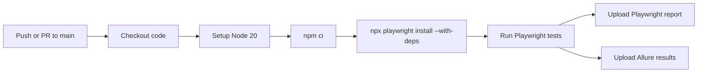

# Learning Hub

<p align="center">
  
  
  
  
  
</p>

A beginner-friendly Playwright + TypeScript automation project for the LearnHub LMS app. The suite follows the Page Object Model, uses fixtures for shared setup, and keeps tests readable with short, clear naming.

## Table of contents

- [About](#about)
- [Tech stack](#tech-stack)
- [Features](#features)
- [Folder structure](#folder-structure)
- [Prerequisites](#prerequisites)
- [Setup](#setup)
- [Configuration](#configuration)
- [Running tests](#running-tests)
- [Reports](#reports)
- [CI/CD flow](#cicd-flow)
- [How to add a new page and test](#how-to-add-a-new-page-and-test)
- [Best practices](#best-practices)
- [Troubleshooting](#troubleshooting)
- [Contributing](#contributing)

## About

This project validates the practice QA Learning Hub app at `https://www.practiceqaautomation.com/apps/lms` with Playwright in TypeScript. It is intentionally simple, suited for beginners, and built around plain-language page objects and small, test-focused methods.

## Tech stack

| Tool | Purpose |
| --- | --- |
| Playwright | Browser automation |
| TypeScript | Strong typing and cleaner code |
| Node.js 20 | Runtime |
| dotenv | Load environment variables |
| Allure Playwright | Rich reporting |
| GitHub Actions | CI/CD |

## Features

- Page Object Model for login, signup, and course flows
- Shared fixtures for users and page objects
- `@smoke` and `@regression` tagging for selective execution
- Data-driven invalid login examples
- Browser matrix: Chromium, Firefox, and WebKit
- `.env`-based configuration and secret-safe setup

## Folder structure

```bash
.
├── .github/
│   └── workflows/
│       └── playwright.yml
├── documents/
│   ├── README.md
│   ├── project-overview.md
│   ├── folder-structure.md
│   ├── pages.md
│   ├── assertions.md
│   ├── fixtures.md
│   ├── test-data-and-env.md
│   ├── tests.md
│   ├── configuration-and-ci.md
│   ├── coding-standards.md
│   ├── how-to-add-a-test.md
│   └── troubleshooting.md
├── pages/
│   ├── assertions.ts
│   ├── base-page.ts
│   ├── courses-page.ts
│   ├── fixtures.ts
│   ├── login-page.ts
│   └── shop.ts
├── tests/
│   ├── specs/
│   │   ├── login.spec.ts
│   │   └── signup.spec.ts
│   └── test_data/
│       └── user.json
├── .env
├── .env.example
├── .gitignore
├── .prettierrc
├── eslint.config.mjs
├── package.json
├── playwright.config.ts
├── tsconfig.json
└── README.md
```

## Prerequisites

- Node.js 20+
- npm
- Playwright browser dependencies

## Setup

```bash
npm install
cp .env.example .env
```

Then update `.env` with your local values.

## Configuration

The project reads configuration from `.env` with `dotenv`.

```env
BASE_URL=https://www.practiceqaautomation.com/apps/lms
LEARNER_EMAIL=learner@learnhub.dev
LEARNER_PASSWORD=Learn@123
NEW_USER_EMAIL=learner+new@learnhub.dev
NEW_USER_PASSWORD=StrongPass@123
```

## Running tests

| Command | Purpose |
| --- | --- |
| `npm test` | Run the full suite |
| `npm run test:smoke` | Only `@smoke` tests |
| `npm run test:regression` | Only `@regression` tests |
| `npm run test:headed` | Run in headed mode |
| `npm run test:ui` | Open Playwright UI |
| `npm run report` | Open HTML report |
| `npm run report:allure` | Start Allure server |
| `npm run lint` | Run ESLint |
| `npm run format` | Format with Prettier |

## Reports

The project is configured to generate:

- HTML report
- list reporter output
- Allure results

Open the HTML report with:

```bash
npm run report
```

## CI/CD flow



## How to add a new page and test

1. Create a new page object in `pages/`.
2. Extend the BasePage helper for shared actions.
3. Add the page to the `Shop` fixture collection.
4. Write a short test in `tests/specs/`.
5. Tag tests with `@smoke` or `@regression`.

Example:

```ts
export class DashboardPage extends BasePage {
  readonly profileName = this.page.getByText('Welcome, Demo');

  async open() {
    await this.goto('/courses');
  }
}
```

## Best practices

- Keep locators in page objects, not tests.
- Use web-first assertions.
- Prefer small methods with one purpose.
- Avoid `waitForTimeout` and `sleep`.
- Keep test titles descriptive and ID based.

## Troubleshooting

- If the app does not load, check `BASE_URL` in `.env`.
- If a selector is stale, confirm the label or test ID in the browser.
- If tests are flaky in Firefox/WebKit, avoid `networkidle` waits.
- When a new user is needed, create a unique email value.

## Contributing

1. Create a branch.
2. Add a small, clear test.
3. Validate with Playwright.
4. Keep the code beginner-friendly and readable.

---

This project is designed to teach simple, maintainable automation patterns while still being useful for real QA work.
